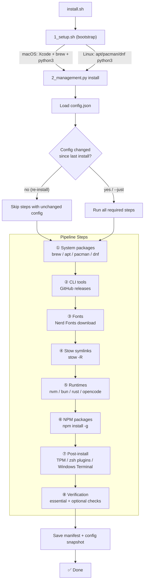
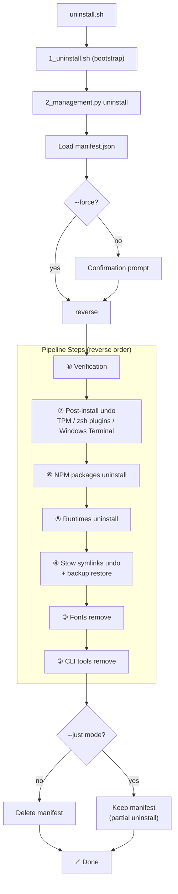
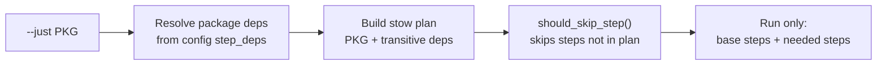
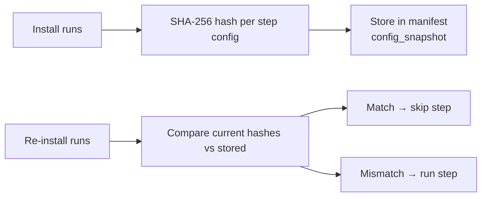
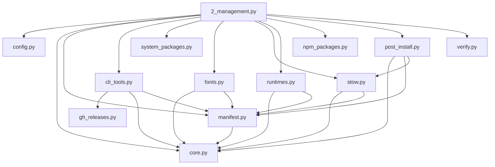

# Architecture

## Install Flow



## Uninstall Flow



## --just Mode



## Config Snapshot (Change Detection)



## Module Dependencies



## File Layout

```
dotfiles/
├── install.sh                          # User entry point
├── uninstall.sh                        # Uninstall entry point
├── config.json                         # All pipeline config
├── dotfiles-manifest.json              # (generated) Last install snapshot
├── stow-packages/                      # Source for stow symlinks
│   ├── lazyvim/
│   ├── zsh/
│   ├── tmux/
│   ├── ghostty/
│   └── ...
├── tools_management/
│   ├── 1_setup.sh                      # Bootstrap (bash)
│   ├── 1_uninstall.sh                  # Uninstall bootstrap (bash)
│   ├── 2_management.py                 # Pipeline orchestrator
│   ├── config.py                       # Config loader
│   ├── core.py                         # Shared utilities
│   ├── manifest.py                     # Manifest CRUD + change detection
│   ├── cli_tools.py                    # CLI tool install orchestration
│   ├── gh_releases.py                  # GitHub release downloader
│   ├── system_packages.py              # OS package manager interface
│   ├── fonts.py                        # Nerd Font installer
│   ├── stow.py                         # Stow symlink management
│   ├── runtimes.py                     # Runtime/version manager installer
│   ├── npm_packages.py                 # Global npm package installer
│   ├── post_install.py                 # Post-install hooks
│   └── verify.py                       # Install verification
└── testing/
    ├── test_pipeline.py                # Test orchestrator (linux/wsl via Docker, mac via --check)
    ├── docker-compose.yml              # Docker compose services
    ├── test_containers/
    │   ├── test_pipeline.sh            # Shared pipeline test script
    │   ├── Dockerfile.linux            # Linux container
    │   └── Dockerfile.wsl              # WSL container (fake /mnt/c)
    └── logs/                           # (generated) Test output logs
```
